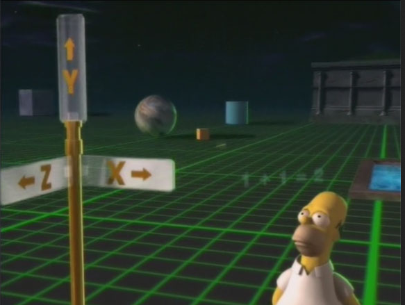

background-image: url('meme.png')
background-size: contain
class: middle, left, inverse

```{r setup, include=FALSE}

library(xaringanExtra)
library(here)

xaringanExtra::use_fit_screen()
xaringanExtra::use_tile_view()
xaringanExtra::use_panelset()

options(htmltools.dir.version = FALSE)
```

---

## Proposed order

<br>

### Discourse on the Method


### Meditations on First Philosphy


### Of the Principles of Material Things


### The Cartesian Masculinization of Thought

---
### Discourse on the Method

.panelset[

.panel[.panel-name[Method]

.pull-left[

Simple rules that allow oneself to find the truth of things.

  + Never accept anything as true if there is no knowledge of this being so.
  + Divide each problem examined into as many parts as feasible.
  + Direct my thoughts in an orderly way; beginning from the simplest to the most complex. 
  + Survey or enumerate to avoid leaving something out.
]

.pull-right[

]

]

.panel[.panel-name[Maxims]

.pull-left[
  + Obey the laws and customs of my country.

  + To be firm and resolute in action as I could, and to follow out my most doubtful opinions.
  
  + Try to always conquer myself  rather than fortune (link with Bordo, 1986).
  
  + Cultivate my reason and to advance as far as I could in the knowledge of truth following the method]
]

.panel[.panel-name[A thing that thinks]


.pull.left[
> But immediately upon this I noticed that while I was trying to think everything false, it must needs be that I, who was thinking
this (*qui le pensais*), was something. And observing that this truth 'I am thinking (*jepenre*), therefore I exist' was so solid

>  ...I had no body, that there was no world, and no place existed for me to be in, I could not feign that I was not; on the contrary, from the mere fact that I thought of doubting (je pensais Li edouter) about other truths it evidently and certainly followed that I existed.

]  

.pull-right[]

<!-- > From this I recognised that I was a substance whose whole essence or nature is to be conscious (de penser) and whose being requires no place and depends on no material thing. Thus this self (moi), that is to say the soul, by which I am what I am, is entirely distinct from -->
<!-- the body, and is even more easily known; and even if the body were not there at all, the soul would be just what it is. -->

<!-- Mind / body division -->

]

.panel[.panel-name[Space as extension]

.pull-left[
> After this I wished to seek for other truths; I took the subject-matter of geometry, which I conceived to be a continuous body or a space indefinitely extended in length, breadth, and height or depth, divisible into distinct parts, which may have distinct shapes and sizes and may be moved or transposed in all sorts of ways ; for the geometers assume all this in their subject-matter.

]

.pull-right[]
]

]

---
class: inverse, center, middle

# Meditation on the First Philosophy
---
### Main ideas

<br>

* Geometry and arithmetic deal with simple things which veracity is simple to confirm.

* The body [space] is defined by a figure, can interact with other bodies, and be perceived through the senses.

* Bodies can only be understood intellectually. 

* Ideas can be true as they conceived in the mind and are not related with the outside.

* God is the source of true knowledged (universal truth or *form*?)


???

Creo que aquí está la clave para entender las cosas. Es a partir de las ideas (en contraste con los sentidos) en donde realmente podemos encontrar la certeza de las cosas, puesto que las ideas están separadas de lo real que puede ser propenso a la falsedad. Además, si al estar pensado estoy asegurando mi existencia, que a su vez es la verdad más fundamental, es esta la base desde la que uno puede construir ideas más complejas con la certeza de su realidad. Esto siempre y cuando bajo el supuesto de que lo que pienso no tiene relación con lo que exisete fuera de mi mente.

---
class: center, middle

> Nothing further now remains but to inquire whether material things
exist. And certainly I at least know that these may exist in so far as they
are considered as the objects of pure mathematics, since in this aspect I
perceive them clearly and distinctly. . 

If I can express and understand it mathematically then it is real. 

---
class: middle, center, inverse

# On the principles of material things

---

.panelset[

.panel[.panel-name[Properties]

.pull-left[
* The body or matter is a multidimensional object with  length, breadth, and depth (P2).

* The true nature of any matter can be reduced to its three dimensions (P4).
  
* The space (void) is also conformed by this body or matter extended (P5).
]

.pull-right[

]
]

.panel[.panel-name[Dynamics]

* The body can extend (refract) or contract (condense). 

* Quantitative changes are proportional to changes in the body / matter (P8).
]

.panel[.panel-name[Body - Space]

.pull-left[

* There is no distinction between internal and external space (P 10-13). 
  
  + Bodies seem to have a particular *extension* that changes with them.
  + Hierarchical nature of the *extension* that constitutes the body and the space.

* When the external surrounds an object the surface is the part of the *extension* that is part of both and none.
]

.pull-right[

]

]

.panel[.panel-name[Relational understanding]

* Since the internal and external space are the same, there cannot be movement.

* Movement depends on the relative position with other bodies or objects that are fixed (P13).

* The universe is in constant change, even if we were still, we would be in motion.

.center[

]
]

.panel[.panel-name[Void]

* Do not exist.

* Is the part of the extension where we expect to be something (P18). 

* There cannot be superimposition of matter (P19).

]

]

---
class: inverse, center, middle

# Masculinization of thought

---
### Extraction of the feminine

<br>

* Mind / body separation

* Human / Nature separation

* Detachment, quantification, *objectivity*.

* Natural / Social sciences.

